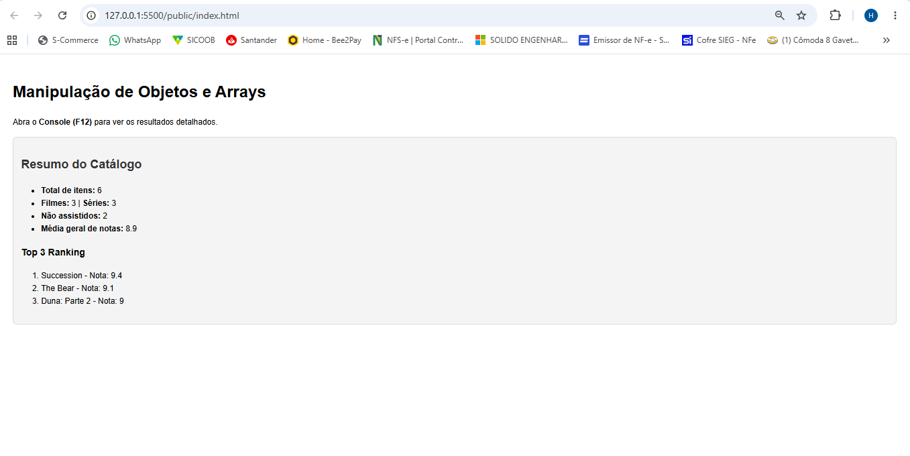
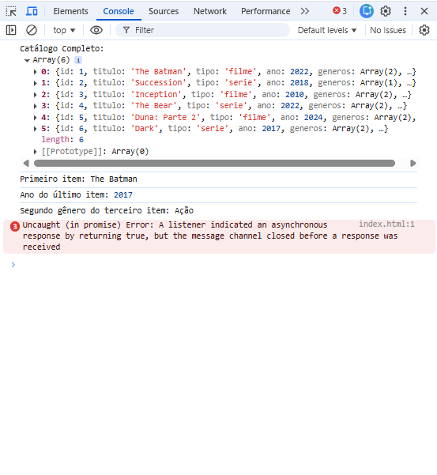

# Trabalho Prático - Semana 8

Nesta atividade, você fazer exercícios de programação para vai praticar a manipulação de objetos e arrays em JavaScript, passando pela definição de dados em notação **JSON (JavaScript Object Notation)**, acessando propriedades e itens.
## Informações Gerais

- Nome: Hugo Faria Santos
- Matricula: 928883

## Prints do console do navegador

